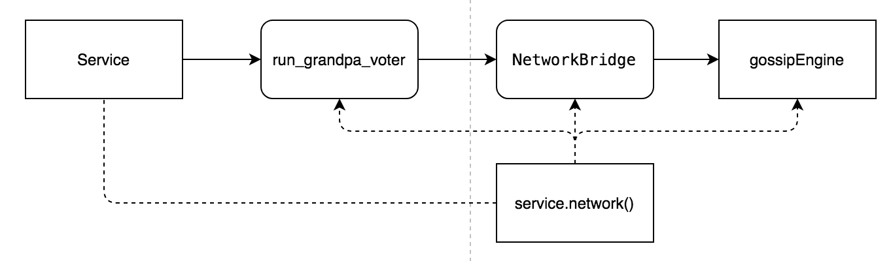
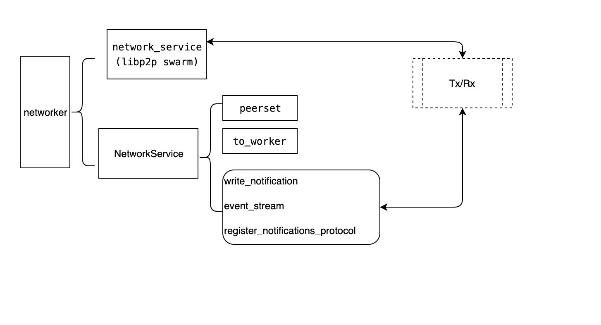

# 入口
当我们执行命令行启动节点的时候，到底发生了什么呢？  
首先，我们每个节点称为客户端(client)，客户端分两种全节点客户端（full client)和轻节点客户端(light client) 
启动全节点，使用的是`new_full_start`宏，我们看详细看 
```rust
macro_rules! new_full_start {
    ($config:expr) => {{
        use std::sync::Arc;
        let mut import_setup = None;
        let inherent_data_providers = sp_inherents::InherentDataProviders::new();

        let builder = sc_service::ServiceBuilder::new_full::<
            node_template_runtime::opaque::Block, node_template_runtime::RuntimeApi, crate::service::Executor
        >($config)?
            .with_select_chain(|_config, backend| {
                Ok(sc_client::LongestChain::new(backend.clone()))
            })?
            .with_transaction_pool(|config, client, _fetcher| {
                let pool_api = sc_transaction_pool::FullChainApi::new(client.clone());
                Ok(sc_transaction_pool::BasicPool::new(config, std::sync::Arc::new(pool_api)))
            })?
            .with_import_queue(|_config, client, mut select_chain, _transaction_pool| {
                let select_chain = select_chain.take()
                    .ok_or_else(|| sc_service::Error::SelectChainRequired)?;

                let (grandpa_block_import, grandpa_link) =
                    grandpa::block_import(client.clone(), &(client.clone() as Arc<_>), select_chain)?;

                let aura_block_import = sc_consensus_aura::AuraBlockImport::<_, _, _, AuraPair>::new(
                    grandpa_block_import.clone(), client.clone(),
                );

                let import_queue = sc_consensus_aura::import_queue::<_, _, _, AuraPair>(
                    sc_consensus_aura::slot_duration(&*client)?,
                    aura_block_import,
                    Some(Box::new(grandpa_block_import.clone())),
                    None,
                    client,
                    inherent_data_providers.clone(),
                )?;

                import_setup = Some((grandpa_block_import, grandpa_link));

                Ok(import_queue)
            })?;

        (builder, import_setup, inherent_data_providers)
    }}
}
```
首先看到创建一个`inherent_data_providers`实例，我们过会儿再讨论，先看
`sc_service::ServiceBuilder::new_full::<A,B,C>`  
ServiceBuilder是构建服务的聚合器，用` node_template_runtime::opaque::Block`, `node_template_runtime::RuntimeApi`, `crate::service::Executor`作为参数来实例化了A，B和C，望文生义，前两个是修改过的，与node_template相关的，最后一个是直接用的库里的，我们先看`ServiceBuilder`，根据`client/service/src/builder.rs`中的说明：  
#### `ServiceBuilder` 用法是这样的：  
> 调用`ServiceBuilder::new_full`或是`ServiceBuilder::new_light`创建全节点或是轻节点，然后需要再调用不同的`with_`方法来调用你创建的另外的组件  
>    1. [`with_select_chain`](ServiceBuilder::with_select_chain) 分叉选择算法  
>    2. [`with_import_queue`](ServiceBuilder::with_import_queue)  区块导入算法  
>    3. [`with_finality_proof_provider`](ServiceBuilder::with_finality_proof_provider) 最终确定证明提供？  
>    4. [`with_transaction_pool`](ServiceBuilder::with_transaction_pool) 交易池算法    
>    5. 当这些完成后，调用[`build`](ServiceBuilder::build) 来创建服务   

对照上述代码  
1.  ` sc_service::ServiceBuilder::new_full::<...>($config)` 创建一个全节点
2. `with_select_chain(|_config, backend| {Ok(sc_client::LongestChain::new(backend.clone()))})? ` 采用sc_client::LongestChain来实现分叉选择，并且将存储后端作为参数传递给他
3. 创建一个`sc_transaction_pool::BasicPool`类型的交易池
4. 使用`with_import_queue(|_config, client, mut select_chain, _transaction_pool| {...}`创建一个区块导入方案，该方案实现了以下几个工作
   1. 测试`select_chain`是否可用，是否需要
   2. 根据grandpa和aura算法创建一个import_queue实例
5. 没有使用`with_finality_proof_provider`来进行最终确定化
#### 创建gossip协议 
network-gossip 和network是松耦合的


其中`network()`函数返回了一个`NetworkService`对象，即gossip使用的包装成`NetworkService`后的网络层
### Protocol
Protocol管理一个连接上的所有的协议，目前的框架中，支持在一个连接上面运行多个协议，每一个协议都是通过`GenericProto::register_notif_protocol`来实现,为了快速查询到某个name对应的protocol,Protocol使用`register_notifications_protocol`

* kad网络也是通过new_handler作为一个handler处理的
#### 几个类的简单分析  
* sc_client::LongestChain， 应该是选用最长链的分叉合并算法
* sc_transaction_pool::BasicPool 最基本的交易池处理算法
* 

### ServiceBuilder详解
```rust
pub struct ServiceBuilder<TBl, TRtApi, TGen, TCSExt, TCl, TFchr, TSc, TImpQu, TFprb, TFpp,
    TExPool, TRpc, Backend>
{
    config: Configuration<TGen, TCSExt>,
    pub (crate) client: Arc<TCl>,
    backend: Arc<Backend>,
    tasks_builder: TaskManagerBuilder,
    keystore: Arc<RwLock<Keystore>>,
    fetcher: Option<TFchr>,
    select_chain: Option<TSc>,
    pub (crate) import_queue: TImpQu,
    finality_proof_request_builder: Option<TFprb>,
    finality_proof_provider: Option<TFpp>,
    transaction_pool: Arc<TExPool>,
    rpc_extensions: TRpc,
    remote_backend: Option<Arc<dyn RemoteBlockchain<TBl>>>,
    marker: PhantomData<(TBl, TRtApi)>,
    background_tasks: Vec<(&'static str, BackgroundTask)>,
}
```
1. config 配置管理器实例
2. client 节点实例
3. backend 数据后端实例
4. tasks_builder 任务创建器实例
5. keystore 密钥库实例
6. fetcher 数据读取器实例？
7. select_chain 分叉合并算法实例
8. import_queue 导入算法实例
9. finality_proof_request_builder 最终确认化算法生成器
10. finality_proof_provider 最终确定化算法提供器实例
11. transaction_pool 交易池实例
12. remote_backend  远程数据后端（用于轻节点？）
13. marker  幽灵数据,仅为了生命周期
14. background_tasks 后台任务

这个类对象可以通过几个`with_`函数来配置相应的内部属性，配置完成后，使用`.build`函数实现实际的启动
##### build函数流程
1. 创建一个会话key
2. 创建一个错误处理通道，当关键参数错误时，可以通过通道得到消息，最后输出给service了
3. 创建import_queue的实例指针
4. 输出当前节点的链的信息
5. 把tx_pool注册给execution_extensions
6. 创建一个默认的区块验证器
7. 配置网络参数然后利用该网络参数创建一个网络
8. 建立一个网络状态接收器用以跟踪网络状态
9. 如果配置了离线工作线程，使用当前的后端存储器，配置此线程
10. 启动backgroud-tasks里的任务，默认里面只有一个一个tx-pool
11. 针对每一个流，创建区块到达和finilize最终化事件，并且事件通知配置给离线工作线程和txpool的维护线程
12. 对交易消息进行处理
    1.  生成一个线程，处理交易池里导入的消息
    2.  每收到一个交易，广播出去
13. 创建prometheus的监听
14. 启动RPC服务，并且对外暴露
15. 使用b`build_network_future`启动网络
16. 利用上述创建产生的实例，创建一个Service对象并且返回

### 全节点
上述的示例创建了一个全节点，全节点类型是是TFullClient,由4种类型模板参数组成
- `TFullBackend<TBl>`    数据存储后端？
- `TFullCallExecutor<TBl, TExecDisp>` 代码执行器？
- `TBl`  区块？
- `TRtApi` 运行时的API？
  

1. `TFullBackend<TBl>`是实例化的`sc_client_db::Backend<TBl>`  
2. `TFullCallExecutor`需要两个类型TBl, TExecDisp，实际上使用了`sc_client::LocalCallExecutor`，而这个类型使用了两个类型模板`sc_client_db::Backend<TBl>`, `NativeExecutor<TExecDisp>`

`sc_client_db::Backend<TBl>`是数据存储后端，

`NativeExecutor`实现了`RuntimeInfo`、`CodeExecutor`、`Clone`、`sp_core::traits::CallInWasm`接口。在`client/executor/src/native_executor.rs`文件中。而实际上，NativeExecutor使用`NativeExecutionDispatch`模板参数。 在此文件中，实现了生成 `NativeExecutionDispatch`的执行器宏：`native_executor_instance`.  
这个宏的基本用法如下：  
```
sc_executor::native_executor_instance!(
     pub MyExecutor,
     substrate_test_runtime::api::dispatch,
     substrate_test_runtime::native_version,
 );
 ```
#### 定制函数接口
当你希望使用你定制的runtime接口时，你需要让执行器宏了解这些接口的功能。
 ```
 # use sp_runtime_interface::runtime_interface;

 #[runtime_interface]
 trait MyInterface {
     fn say_hello_world(data: &str) {
         println!("Hello world from: {}", data);
     }
 }

 sc_executor::native_executor_instance!(
     pub MyExecutor,
     substrate_test_runtime::api::dispatch,
     substrate_test_runtime::native_version,
     my_interface::HostFunctions,
 );
 ```
 *TODO*   my_interface是什么?


### TransactionPool
`client/network/src/service.rs`中的TransactionPool和`client/transaction-pool/src/lib.rs`中的TransactionPool的差别：
1. 前者的交易池多了import(导入交易到交易池）和transtransactions_to_propagate（把交易池中的交易转化成vec形式，可用于广播）的功能
2. 在链上使用的时候，需要使用前者，其实是增加了导入和导出的功能

transactions_to_propagate,把pool里的的交易变成Vec的形式
chain_spec的表明这个链的，里面包括了protocol_id,genesis区块等信息

## GenericProto

`GenericProto`是对节点上所运行的协议的管理器，他通过`notif_protocols`对所有协议进行管理，并且具有一个自身的peer管理器`peers`，与系统级的管理器peerset对应处理。
`GenericProto`增加协议处理是通过`register_notifications_protocol`实现的，这个函数需要两个参数：`engine_id`和`protocol_name`。当协议注册完成后，就可以使用`write_notification`来写入数据了。  
事件及数据是通过poll函数获得的,在poll函数中，通过behaviour获得消息后进行分析处理，如果是协议消息，直接处理，否则交给`on_custom_message`函数处理
`on_custom_message`函数处理后，得到一个处理结果，poll函数根据此结果决定返回Pending还是Ready。 在返回的时候，使用`NetworkBehaviourAction::GenerateEvent`来生成事件


## Behaviour(行为)
Behaviour是定义Swarm上的Peer如何工作的，我们可以任意添加多个Behaviour到一个Swarm上，在目前的实现中，只是添加了一个debug_info和一个kad/DiscoveryBehaviour的行为对象。  
Behaviour的第一个参数是Protocol对象，在代码里，这个对象在Behaviour的仅仅使用了`substrate.add_discovered_nodes`，其核心就是把新发现的节点通知给protocol层，然后由protocol层对其进行处理。  
protocol层的`add_discovered_nodes`是交给了自身的`self.behaviour`执行了一次`add_discovered_nodes`，此处的behaviour是GenericProto的对象。  
`protocol中`的`behaviour`对象是通过`GenericProto::new`创建的
